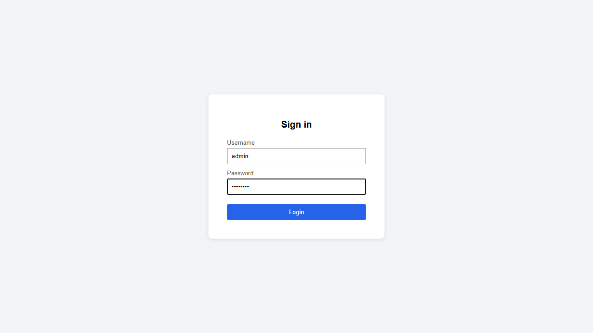
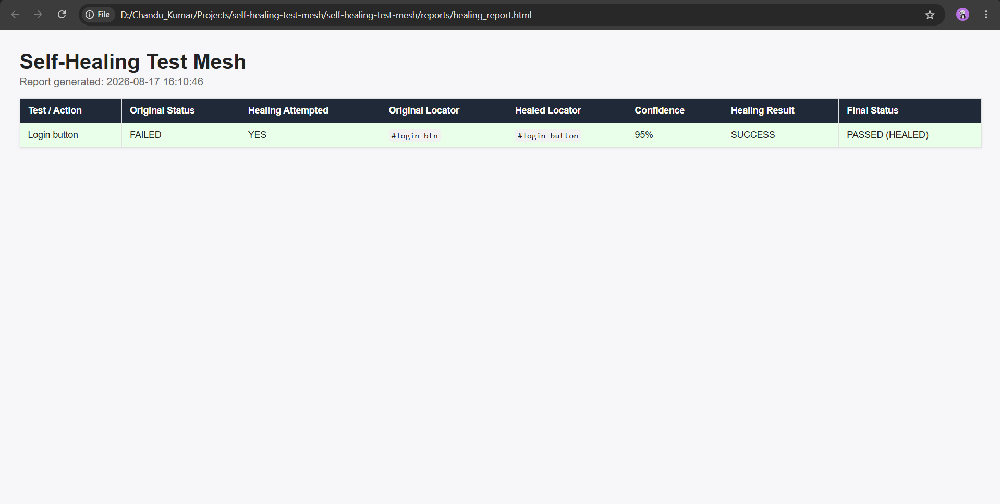

# AI-Powered Self-Healing Test Mesh


An AI-assisted test automation framework built with Playwright and Python that automatically detects failed UI locators and attempts to recover them using an intelligent locator-healing mechanism.


## 🚀 Key Features


- Playwright-based UI test automation
- Self-healing locator mechanism
- AI-assisted locator suggestions
- Mock LLM support for local development
- Automatic retry of failed locators
- Configurable healing attempts
- Healing confidence score
- HTML and JSON execution reports
- Failure and healed execution screenshots
- Pytest integration


## 🏗️ Architecture


```text
Test Case
    ↓
Page Object
    ↓
Playwright
    ↓
Locator Validation
    ↓
Locator Failure
    ↓
AI Locator Engine
    ↓
Mock LLM
    ↓
Suggested Locator
    ↓
Locator Validation
    ↓
Retry with Healed Locator
    ↓
Test Result + Report
🔄 How Self-Healing Works

When a test fails because an expected locator is no longer valid:

The framework detects the locator failure.
The failed locator is sent to the locator healing engine.
The AI locator engine generates an alternative locator.
The suggested locator is validated against the page.
If the locator is valid, the test retries using the healed locator.
The execution result is recorded in the healing report.
Screenshots are captured for failure and healed executions.
🧪 Example

Original locator:

#login-btn

The application contains:

#login-button

The original locator fails, triggering the healing mechanism.

The framework identifies:

#login-button

with a confidence score of:

95%

The test then succeeds using the healed locator.

Result
Original Status : FAILED
Healing         : SUCCESS
Original        : #login-btn
Healed          : #login-button
Confidence      : 95%
Final Status    : PASSED (HEALED)
🛠️ Tech Stack
Python
Playwright
Pytest
HTML / CSS
REST API
Mock LLM
Git / GitHub
📁 Project Structure
self-healing-test-mesh/
│
├── demo/
│   └── login.html
│
├── healing/
│   ├── ai_locator.py
│   ├── healer.py
│   └── locator_validator.py
│
├── pages/
│   └── login_page.py
│
├── reports/
│   ├── healing_report.html
│   └── healing_report.json
│
├── screenshots/
│   ├── test_login_with_self_healing_failed.png
│   └── test_login_with_self_healing_healed.png
│
├── tests/
│   └── test_login.py
│
├── utils/
│   ├── config.py
│   └── report_generator.py
│
├── mock_llm_server.py
├── conftest.py
├── pytest.ini
├── requirements.txt
└── .env.example
▶️ Running the Project
1. Clone the repository
git clone https://github.com/chandu-kumar-ks/self-healing-test-mesh.git
cd self-healing-test-mesh
2. Create a virtual environment
python -m venv .venv
3. Activate the environment

Windows:

.venv\Scripts\activate
4. Install dependencies
pip install -r requirements.txt
5. Install Playwright browsers
playwright install
6. Start the Mock LLM

Open a separate terminal:

python mock_llm_server.py

The server runs at:

http://127.0.0.1:8000
7. Run the tests
pytest -v -s
📊 Test Result

Example execution:

tests/test_login.py::test_login_with_self_healing PASSED


1 passed

The framework also generates:

reports/healing_report.html
reports/healing_report.json
## 📸 Self-Healing Execution

### 1. Original Locator Failure

The test initially fails because the original locator `#login-btn` is no longer available.



### 2. Automatic Locator Healing

The framework identifies the updated locator `#login-button` and retries the action successfully.



### Healing Result

| Property | Result |
|---|---|
| Original Locator | `#login-btn` |
| Healed Locator | `#login-button` |
| Confidence | 95% |
| Healing Result | SUCCESS |
| Final Status | PASSED (HEALED) |

🎯 Purpose

This project demonstrates how AI-assisted techniques can be integrated into modern test automation frameworks to improve resilience against UI locator changes.

It is designed as a proof-of-concept for reducing maintenance caused by frequently changing UI locators.

🔮 Future Enhancements
Integration with OpenAI-compatible production LLMs
Support for multiple locator strategies
DOM similarity analysis
Historical healing data
Healing success analytics
CI/CD integration
Automatic locator updates
Multi-browser execution

👨‍💻 Author
K S Chandu Kumar